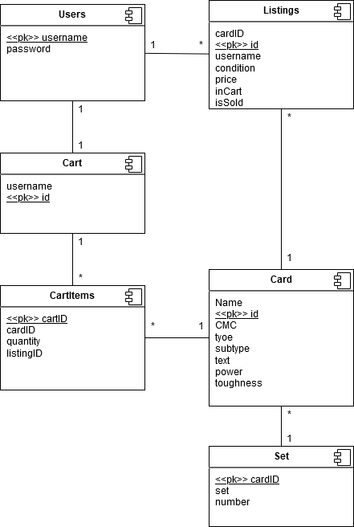

# Card Marketplace

## Description

This software is a database system for an online trading card marketplace. There is a
database storing all available cards, one storing cards for sale (with prices), and a
backend for adding items to a user’s cart. The user can check out, which totals out their
cart and removes all the items they purchased from the listings database.

## Installation

- Extract all files and run Main.java or Card Marketplace.jar
- If you see something named “Python” it is a naming mistake, we did use only
  Java, JDBC, and SQLite.
- There are three database files, one in the ‘src’ folder, one in the ‘out’ folder, and
  one in the root folder. Utilize the one in the root folder for the application

## Use Instructions

- Start by clicking “Menu” in the toolbar in the top left. Then click on “Select DB”
  and find the database supplied in the extraction.
- The GUI will start you off on the Search Listings Tab.
- Begin searching by entering a Card ID, which is a number between 1-1000. You
  may also search for a keyword like “crow” and it will find all cards with crow in it’s
  name. Searching without entering anything will search for all cards up to a limit of
  100 cards.
- On the left panel, the search results will appear. Pressing view will display the
  card description in the center panel, and also listings in the right panel.
- You can change users by clicking “Menu” in the toolbar in the top left, then
  “Change User”.
- On the right panel, clicking add to cart will add that listing item into your cart
- In order to add listings, ensure that you are viewing the card you wish to create a
  listing for, and then click “Card” in the toolbar in the top left and then “Add
  Listing”. You will be prompted for a price. The listing should then be loaded into
  the right panel. If nothing appears in the panel, ensure that you are entering a
  valid price.
- To remove cart items, click remove on an item in the cart. The listing should
  reappear upon clicking view on the card again.

## Database Schema

- Card (name, id , cmc, type, subtype, text, power, toughness)
- Cart (username, id )
- CartItems (cartID, cardID, quantity, listingID)
- Listing (cardID, username, condition, price, id , inCart, isSold)
- "Set" ( cardID , "set", number)
- Users ( username , password)

## UML Diagram

